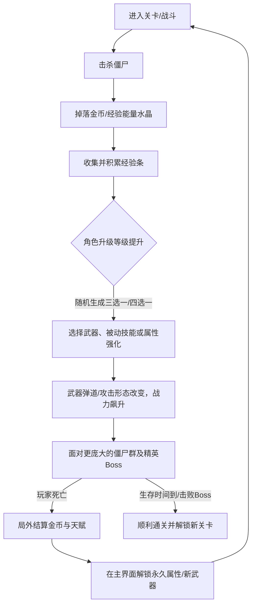

# 2D Roguelite 射击游戏：《僵尸狂潮：超载重启 (Zombie Overdrive)》设计方案

本项目为一个主打“爽快割草”、“多武器成长”和“随机局内升级”的 2D 俯视角（Top-Down）Roguelite 射击游戏，采用 Unity 2D 引擎进行开发。以下为该游戏的基本设计方案、系统平衡与技术落地指南。

---

## 1. 核心游戏循环 (Core Game Loop)

游戏主要通过“战斗 -> 收集 -> 随机升级 -> 变强 -> 挑战更强敌人”的闭环，为玩家提供心流体验。



---

## 2. 武器系统与详细升级分支 (Detailed Weapon Matrix)

游戏中目前规划有 **6 种特色各异的武器**。玩家在局内升级时，可以通过获取同名卡牌来提升武器的等级（1-5 级），并在满足被动条件后触发“觉醒超武（Evolution）”。

下面是每种武器的 1 至 5 级详细升级属性与觉醒效果：

### 🔫 武器 A. 哨兵手枪 (Pistol)
*单发基础武器，以高精准度和机动性为主，满级后能打出密集的弹幕。*
*   **Lv 1：** 发射单发能量子弹，伤害中等，弹夹容量无限。
*   **Lv 2 (枪斗术增幅)：** 射速提升 25%，单发子弹伤害提升 15%。
*   **Lv 3 (战术分裂)：** 子弹在命中首个目标后分裂成 2 颗较小的子弹，呈 45 度角射向两侧，可继承 50% 基础伤害。
*   **Lv 4 (双枪齐射)：** 武器变更为双持状态。每次开火发射 2 发平行的子弹，且换弹/攻击间隔缩短 20%。
*   **Lv 5 (弱点校准)：** 子弹获得 2 次穿透能力，且对受到流血、冰冻、减速等异常状态的僵尸造成双倍伤害。
*   **🌀 终极觉醒【双持毁灭者】：** 攻击方式变为全自动疯狂扫射，射速提升 100%，子弹无限穿透。子弹每次穿透敌人都会在伤口处触发一次动能微型爆炸，造成小范围二次伤害。

---

### 💥 武器 B. 爆裂散弹枪 (Shotgun)
*近距离的爆发之王，拥有极强的群控退敌效果，缺点是射速较慢且有装弹时间。*
*   **Lv 1：** 扇形发射 5 颗弹丸，近距离全中可造成爆发伤害，具有强力的击退效果。
*   **Lv 2 (弹药集束)：** 弹丸数量增加至 7 颗，散射角度缩窄 15%（弹药更凝聚，提升中距离击杀效率）。
*   **Lv 3 (灼热火药)：** 弹丸附带燃烧效果。被命中的敌人会在 3 秒内受到持续火焰伤害（DOT），并可点燃周围其他僵尸。
*   **Lv 4 (战术快充)：** 装弹时间减少 40%，且散弹的整体击退距离提升 30%。
*   **Lv 5 (钢珠穿甲)：** 散弹获得 1 次穿透效果，能够直接打穿前排僵尸并重创后方敌人。
*   **🌀 终极觉醒【地狱火风暴】：** 开火方式重构。每次开火不再呈前方扇形，而是向四周 360 度发射 24 颗大型熔岩爆裂弹。在推开并点燃所有近身敌人的同时，还会在地面留下大片持续 2 秒的燃烧火海。

---

### ⚡ 武器 C. 电磁手套 (Tesla Glove)
*极佳的群体减速与导电传导武器，能有效应对大面积的低血量僵尸群。*
*   **Lv 1：** 射出一条链式电弧，自动锁定并传导至最多 3 个目标，造成伤害并附带 20% 感电减速。
*   **Lv 2 (高压过载)：** 电弧传导链上限提升至 5 个敌人，且对主目标（第一名受击者）的电击伤害提升 35%。
*   **Lv 3 (脉冲震荡)：** 被电弧击中的僵尸有 15% 的几率陷入 0.5 秒的麻痹僵直状态，打断其攻击动作。
*   **Lv 4 (磁力扩张)：** 电弧的寻找传导距离增加 40%，且传导过程中有 30% 几率分裂出次级电弧。
*   **Lv 5 (闪电链爆)：** 被电弧击杀的僵尸会在原地发生一次范围电磁爆炸，对周围僵尸造成可传导的二次伤害。
*   **🌀 终极觉醒【雷神之怒】：** 攻击转化为一道持续不断的雷霆射线。按住射击键将持续扫射，在射线范围内的所有僵尸会自动引下落雷，形成一道密集的感电雷网，群体减速 50% 并伴随高频眩晕。

---

### 🕳️ 武器 D. 重力黑洞炮 (Singularity Gun)
*强力的功能性武器，通过引力牵引敌人，强制聚集怪物以配合其他高伤武器。*
*   **Lv 1：** 发射一颗飞行缓慢的重力引力球，持续将半径 3 米内的僵尸向球体中心牵引。
*   **Lv 2 (事件视界)：** 黑洞的吸引半径增加 30%，但光球飞行速度降低 20%（以延长其在场上的持续牵引时间）。
*   **Lv 3 (空间撕裂)：** 被吸入重力球中心的敌人，每 0.5 秒会受到其最大生命值 2% 的百分比割裂伤害。
*   **Lv 4 (重力偏折)：** 重力球现在不仅吸引怪物，还能吸卷并吞噬掉敌方吐出的远程酸液弹或弹幕。
*   **Lv 5 (双重奇点)：** 弹夹容量增加，场上允许同时存在 2 个活动的引力黑洞，引力效果互相叠加。
*   **🌀 终极觉醒【暗物质坍缩】：** 射出一颗超大质量的暗物质奇点，牵引半径扩大至大半个屏幕。在持续吸附 5 秒后，奇点会发生剧烈坍缩，产生一次毁天灭地的全屏清障爆炸。

---

### ⚔️ 武器 E. 光刃·影切 (Lightblade)
*高风险、高回报的近战冷兵器，砍杀手感极佳，满级后可化身为战场无敌刺客。*
*   **Lv 1：** 在玩家正前方进行 120 度扇形近战挥砍，造成高额范围物理伤害并带有中等击退。
*   **Lv 2 (剑气纵横)：** 挥砍半径增加 25%，且每次挥剑会在剑尖射出一道短距离的半月形穿透剑气。
*   **Lv 3 (灵动架势)：** 挥刀速度（攻击频率）提升 30%，且在挥刀的瞬间自身获得 15% 几率的闪避啃咬效果。
*   **Lv 4 (狂暴嗜血)：** 对生命值低于 35% 的残血僵尸必定造成暴击；且每次击杀精英怪有几率回复玩家 2% 生命值。
*   **Lv 5 (圆月风暴)：** 挥砍角度增加至 240 度（几乎覆盖全身周围），剑气射程翻倍且能够进行反弹。
*   **🌀 终极觉醒【影杀·修罗剑阵】：** 挥刀转化为 360 度无死角的旋风刀阵，挥砍时玩家化身残影。每斩中一个敌人都会累积杀意值，满额时自动释放“修罗剑阵”：玩家在屏幕范围内以折线在敌人之间瞬移连斩 12 次，斩击期间玩家处于无敌状态。

---

### 🚨 武器 F. 裂变激光枪 (Fission Laser)
*高科技射线武器，能够提供持续不断的贯穿性线性输出，擅长处理排成直线的僵尸潮。*
*   **Lv 1：** 发射一条能够无限穿透敌人的高热能红激光束，对激光路径上的僵尸造成高频持续伤害（DOT）。
*   **Lv 2 (聚能聚焦)：** 激光束宽度增加 50%，伤害提升 30%，且激光与物体的接触点会产生高温溅射火花。
*   **Lv 3 (棱镜折射)：** 激光在穿透第一个僵尸时，有 30% 几率折射出一条次级细激光射向旁边最近的僵尸。
*   **Lv 4 (热能过载)：** 激光拥有过载伤害叠加机制：对同一个僵尸持续照射时间越长，每秒伤害增加 10%（最高叠加至 60% 额外伤害）。
*   **Lv 5 (光量子风暴)：** 棱镜折射几率提升至 60%，单次激光折射次数上限提升至 3 次，形成激光乱射网络。
*   **🌀 终极觉醒【死光·毁灭裁决】：** 激光分裂为 3 道呈扇形向前方横扫，可穿透屏幕上的任何敌人和掩体。被该死光击杀的僵尸会触发热核裂变，产生链式核爆，对身后的敌人造成毁灭性波及。

---

## 3. 槽位限制与系统平衡性设计 (Slot Limits)

为了保证单局游戏的策略深度，同时不至于让玩家因为道具过多而造成画面过度混乱，**槽位配置** 建议设定为：

*   **主动武器槽 (Active Weapon Slots)：3 个**
*   **被动技能槽 (Passive Skill Slots)：3 个**

*   **🔄 被动融合与槽位释放机制 (Passive Merge & Slot Release)**：
    *   当某件武器达到 5 级，且玩家拥有其适配的被动技能时，通过拾取精英怪/Boss 掉落的武器宝箱可触发**超武觉醒（Evolution）**。
    *   **融合机制**：在觉醒的瞬间，该适配的被动技能会被**彻底融合并吸收到武器中**（被动属性依然永久保留并生效）。
    *   **槽位释放**：原本放置该被动技能的槽位会**立即空出并释放**。此时，被动技能槽将恢复为空闲状态，玩家在后续的升级中可以重新选择其他被动技能（例如通用的战术/生存技能，或其他武器的适配被动）。
    *   *战术爽感*：这意味着在极限成型状态下，玩家通过依次合成 3 件超武，可以将 3 个适配被动全部融入武器，最终单局可拥有 **3 件超武 + 3 个全新通用被动** 的“超载”神装组合，极大地拉高了局内构筑的上限。

> [!TIP]
> **“3 主动 + 3 被动” 的平衡考量：**
> 1. **超武觉醒闭环**：因为觉醒每一个超武（共 6 种）需要【1个5级主动】+【1个特定被动】的组合。如果槽位是 3+3，玩家在单局完美运营下，可以达成最多“3超武神装”的配置。
> 2. **更紧凑的策略选择与后期解限**：3+3 强迫玩家做出前期的极端取舍。然而，随着超武合成释放槽位，玩家在后期可以重新获得被动空槽。这不仅缓解了前期槽位不足的痛点，更将“合成超武”作为了解锁后期战力上限的钥匙，提供了强烈的局内正向反馈。

---

## 4. 全游戏 12 个被动技能矩阵 (The 12 Passives)

游戏共设计 **12 个核心被动技能**，其中 **6 个与武器超武觉醒绑定**，另外 **6 个为通用战术/生存属性**。每个被动最高为 5 级。

| 序号 | 被动技能名称 | 对应超武觉醒武器 | 逐级升级效果 (1⭐ 至 5⭐) |
| :--- | :--- | :--- | :--- |
| **01** | **弹药集束盒 (Ammo Box)** | 爆裂散弹枪 | 提升弹道范围与伤害。武器伤害 +10%/20%/30%/40%/50%，子弹/爆炸/挥砍半径 +5%/10%/15%/20%/25%。 |
| **02** | **超频处理器 (Overclock)** | 电磁手套 | 提升攻击频率。所有武器的射速与攻击速度 +10%/20%/30%/40%/50%。 |
| **03** | **肾上腺素 (Adrenaline)** | 光刃·影切 | 提升敏捷度。角色移动速度 +8%/16%/24%/32%/40%，闪避率 +2%/4%/6%/8%/10%。 |
| **04** | **重型钛合金甲 (Nano Armor)**| 裂变激光枪 | 增强防御。所受伤害降低 8%/16%/24%/32%/40%，并获得所受伤害 5%/10%/15%/20%/25% 的反弹伤害。 |
| **05** | **高能燃料罐 (Propellent)** | 哨兵手枪 | 优化弹道。子弹飞行速度 +15%/30%/45%/60%/75%；Lv 3 额外使远程武器穿透数 +1，Lv 5 穿透数 +2。 |
| **06** | **重力稳定器 (Gravity Core)** | 重力黑洞炮 | 增加持续时间。所有非即时子弹/黑洞/火海在场上的存活时间 +15%/30%/45%/60%/75%。 |
| **07** | **超导电磁铁 (Magnet)** | 无 (通用战术) | 拾取水晶。经验值水晶与金币的自动拾取半径 +30%/60%/90%/120%/150%。 |
| **08** | **生物防护服 (Hazmat Suit)** | 无 (通用生存) | 恢复气血。最大生命值 +20%/40%/60%/80%/100%，每秒生命恢复速度 +0.5/1.0/1.5/2.0/2.5。 |
| **09** | **贪婪芯片 (Greed Chip)** | 无 (通用经济) | 提升收益。局内金币掉落率 +15%/30%/45%/60%/75%，结算时获得的局外代币额外增加 10%/20%/30%/40%/50%。 |
| **10** | **高频雷达 (Radar)** | 无 (通用爆发) | 暴击属性。暴击率 +5%/10%/15%/20%/25%，暴击伤害加成 +20%/40%/60%/80%/100%。 |
| **11** | **紧急除颤器 (Defibrillator)**| 无 (战术容错) | 免死复活。Lv 1 获得 1 次死亡复活机会（以 30% 生命值重返战场）；每升一级，复活时的无敌时间增加 1 秒，复活时生命值增加 15%（5级复活恢复 90% 血量）。 |
| **12** | **战术无线电 (Radio)** | 无 (战术概率) | 宝箱概率。击杀精英/Boss 时掉落高级宝箱概率 +10%/20%/30%/40%/50%，普通僵尸掉落治疗血包的几率翻倍。 |

---

## 5. 局内经验与升级曲线系统 (In-Game Experience & Leveling System)

玩家在单局游戏内通过收集僵尸死亡掉落的“经验能量水晶”来获取经验值（XP），从而提升等级。每升一级可获得“三选一/四选一”的局内武器/被动升级机会。

### 💎 A. 颜色区分经验水晶系统
为避免数值飘字造成画面杂乱以及直观区分掉落品质，游戏使用**颜色**来区分不同大小和经验值的经验水晶：

*   **🔵 蓝色水晶 (Blue Crystal - 基础级)**：
    *   *经验值*：$1 \text{ XP}$
    *   *掉落源*：普通行尸 (Walker) 100% 掉落。
*   **🟢 绿色水晶 (Green Crystal - 卓越级)**：
    *   *经验值*：$5 \text{ XP}$ (相当于 5 个蓝色水晶)
    *   *掉落源*：狂暴狗 (Runner)、强酸喷吐怪 (Spitter) 100% 掉落。
*   **🟡 金色水晶 (Gold Crystal - 精英级)**：
    *   *经验值*：$20 \text{ XP}$ (相当于 4 个绿色水晶)
    *   *掉落源*：巨无霸铁卫 (Tanker) 精英怪掉落，或打破宝箱产出。
*   **🔴 红色水晶 (Red Crystal - 传奇级)**：
    *   *经验值*：$100 \text{ XP}$
    *   *掉落源*：中期 Boss (突变撕裂者) 与最终 Boss (生化暴君) 掉落。

> [!TIP]
> **经验球自动合并优化 (Performance Optimization)**：
> 当同屏内掉落的经验水晶总数超过 120 个时，系统会自动启动“电磁合并”。在玩家视野外或密集区域的低阶水晶（如蓝色）会自动相互融合，生成对应等值的高阶水晶（如 5 个蓝色合并为 1 个绿色），以极大降低同屏游戏对象（GameObject）数量，避免性能卡顿。

### 📈 B. 经验升级曲线设计 (Leveling Curve)
游戏共有 6 个槽位（3主动+3被动），每项可升级 5 次，合计最高 30 次，加上偶尔选择的回血/金币选项，玩家通常只需要达到 **30 - 35 级** 即可达成终极毕业成型。

为保证前期节奏明快、中期策略博弈、后期神装割草，经验升级公式采用 **分段式递增增长 (Segmented Scale)**，而非线性或单一指数曲线，从而完美贴合同屏僵尸密度曲线：

$$\text{RequiredXP}(L) = \begin{cases} 
5 + 10 \times (L - 1) & 1 \le L \le 5 \quad \text{(入门期：极速升级)} \\
50 + 20 \times (L - 5) & 6 \le L \le 12 \quad \text{(成长期：平稳过渡)} \\
190 + 40 \times (L - 12) & 13 \le L \le 25 \quad \text{(瓶颈期：尸潮爆发)} \\
710 + 80 \times (L - 25) & L > 25 \quad \text{(神装期：大割草状态)} 
\end{cases}$$

#### 📊 升级经验分布样例表
*   **Lv 1 → Lv 2**：需要 $5 \text{ XP}$（击杀 5 只普通怪 / 拾取 1 颗绿水晶即可升 1 级）
*   **Lv 5 → Lv 6**：需要 $45 \text{ XP}$
*   **Lv 10 → Lv 11**：需要 $150 \text{ XP}$
*   **Lv 20 → Lv 21**：需要 $510 \text{ XP}$
*   **Lv 30 → Lv 31**：需要 $1110 \text{ XP}$

这个设计的妙处在于：前期玩家只需 30 秒即可连升数级，迅速占满 3 个主动与 3 个被动槽位；而 12 级之后进入槽位打磨与觉醒阶段，升级难度提升，契合中后期同屏怪堆变厚的节奏，确保玩家获得平滑而富有挑战的成长感。

### 🐔 C. 满槽位与满级时的升级备用选项 (Consolation Options)
当玩家局内 3 主动 + 3 被动槽位全满，或者当前已选的所有武器与被动均已升至 5 级满级时，升级面板将不再刷新武器/被动卡牌，而是提供以下固定保底选项以避免游戏逻辑锁死，并为玩家提供即时补充：

1.  **🍗 战地烧鸡 (Field Medkit)**：立即恢复角色最大生命值的 25%。
2.  **💰 补给钱包 (Gold Bag)**：直接获得 $100$ 枚金币（可计入关卡结束后的局外结算）。

---

## 6. 局外养成与成长系统 (Out-of-Game progression)

本游戏设计了完整的“单局割草 -> 结算金币 -> 局外加点 -> 永久变强”的局外养成体系。

### 💰 A. 局外代币获取
当单局游戏结束（玩家死亡、主动退出或顺利通关通关），系统进行资源结算：
* 击杀僵尸、打破木箱、击杀精英怪掉落的**金币**将以 `1:1` 的比例转化为 **局外代币 (Gene Points/金币)**。
* 顺利击败最终波次 Boss 通关，将额外获得 `1000` 金币的通关大礼包。

### 🧬 B. 避难所永久天赋树 (Talent Upgrade Tree)
玩家可以在游戏主界面的“基因重组舱（避难所）”中消费结算的金币，永久升级角色的六项核心基础维度的属性（每项最高 5 级）：

1. **基础体质 (Max HP)**：
   * 永久提升角色生命值上限。每次升级：生命上限 $+10\text{ Point}$（满级 $+50$ 额外生命）。
2. **移动能效 (Movement Speed)**：
   * 永久提升角色移动速度。每次升级：速度 $+5\%$（满级 $+25\%$）。
3. **基因爆发 (Base Damage)**：
   * 永久提升所有武器的基础伤害系数。每次升级：全武器伤害 $+5\%$（满级 $+25\%$）。
4. **电磁吸附 (Magnet Range)**：
   * 增加单局游戏初始的拾取磁铁范围。每次升级：拾取半径 $+15\%$（满级 $+75\%$）。
5. **高效贪婪 (Gold Multiplier)**：
   * 提升单局收集金币的掉落倍率。每次升级：金币收益 $+10\%$（满级 $+50\%$）。
6. **备用能量 (Revive Core)**：
   * 局外极高昂的终极解锁项。Lv 1 解锁后，角色进入关卡将自动获得 **1次免费的原地复活机会**（恢复 30% 生命值）；后续升级将提高复活时的生命值与移动速度。

---

## 7. 僵尸设计与难度平衡曲线 (Enemy Design & Balance)

本项目中，僵尸不仅是“被收割的经验值”，还需要通过差异化的行为和属性，强迫玩家改变走位和武器选择，提供策略乐趣。

### 👾 A. 僵尸种类详细设计

| 僵尸名称 | 基础属性 (初始) | 登场波次 | 机制与特殊技能 | 视觉特征 & 应对策略 |
| :--- | :--- | :--- | :--- | :--- |
| **普通丧尸 (Walker)** | HP: 100<br>移速: 80<br>碰撞冲力: 低 | 00:00 起 | **无特殊技能**：数量极多，纯粹堆怪。 | 绿色皮肤，蹒跚行走。可用任何群伤或单打武器轻松清理。 |
| **狂暴猎犬 (Runner)** | HP: 60<br>移速: 160<br>碰撞冲力: 极低 | 02:00 起 | **加速飞扑**：在距离玩家 4 米时进入“锁定奔跑”状态，移速瞬间提升 25%，并进行撕咬。体积较小。 | 变异四足骨骼，爬行速度极快。散弹枪的强力击退、近战光刃的挥砍、或者电磁手套的减速是极佳克星。 |
| **毒性喷吐者 (Spitter)**| HP: 150<br>移速: 70<br>碰撞冲力: 中 | 04:00 起 | **强酸抛射**：远程攻击。每 3 秒向玩家抛射一颗强酸弹，落地后形成一片直径 2 米的酸液区，踩中受到持续伤害并减速 30%，持续 3 秒。 | 肿胀的喉部，呈淡黄色。需要玩家优先走位近身点杀；重力黑洞炮可吸附并净化酸液弹。 |
| **巨无霸铁卫 (Tanker)** | HP: 600<br>移速: 50<br>碰撞冲力: 极高 | 06:00 起 | **霸体状态**：完全免疫所有常规武器的物理击退。每 5 秒发出一声怒吼，使周围 5 米内普通丧尸移速提升 30%。 | 身披生锈钢板，体型庞大。建议使用重力炮强制牵引，或者利用裂变激光枪（过载增伤）进行单点穿透融化。 |
| **Boss A：突变撕裂者** | HP: 5000<br>移速: 110<br>碰撞冲力: 致命 | 06:00 (准时空投) | **1. 蓄力冲锋**：锁定玩家方向，进行 1.5 秒红线预警，随后以 300% 速度发起冲撞，造成伤害。具有极强冲击力。<br>**2. 地裂震波**：猛击地面，发出 3 道向前方扩散的冲击波。 | 红色变异右臂，体型巨大。观察警示红线，利用摇杆/键盘控制，以 90 度方向进行走位规避。 |
| **Boss B：生化暴君** | HP: 25000<br>移速: 90<br>碰撞冲力: 致命 | 10:00 (终局决战) | **1. 血爆弹幕**：原地驻足，向四周喷射呈螺旋状扩散的血色弹幕。<br>**2. 酸雨降临**：召唤酸雨，随机在玩家位置降下 5 片酸雨圈。<br>**3. 濒死狂暴**：血量低于 30% 时，移速提升 40%，所有技能冷却缩短 50%。 | 全身覆满外骨骼，散发紫色光芒。考验玩家的终极 3C 操控、满级觉醒超武输出和复活/防护甲被动。 |

### 📊 B. 僵尸基础属性成长公式
僵尸的生命值（HP）和移动速度（Speed）会随着**游戏进行时间（$t$，单位：分钟）**以非线性公式递增：

$$\text{HP}_t = \text{HP}_0 \times (1 + \alpha \cdot t)^{1.5}$$
$$\text{Speed}_t = \text{Speed}_0 \times (1 + \beta \cdot t)^{0.5}$$

*   **$\alpha$ (生命成长系数)**: 建议设为 0.25。保证第 10 分钟的僵尸血量约为初始的 6.5 倍。
*   **$\beta$ (速度成长系数)**: 建议设为 0.08。保证僵尸移速虽然加快，但仍在玩家基础移速的可风筝范围内。

### 👥 C. 同屏僵尸上限与关卡10分钟波次时间轴 (Wave Timeline)
为配合关卡整体节奏，单局 10 分钟的设计需要有一套精确的“波次时间表（Wave Spawner Timeline）”以指导代码生成：

*   **⏱️ 00:00 - 02:00 (起步探索波)**：
    *   *怪群特征*：仅生成普通丧尸 (Walker)。同屏上限 30 只。
    *   *目的*：让玩家熟悉走位与射击，快速升到 3~5 级确立初始 Build。
*   **⏱️ 02:00 - 04:00 (狂暴狗突袭波)**：
    *   *怪群特征*：普通丧尸 (Walker) 的刷新率减半，开始大批混入狂暴猎犬 (Runner)。同屏上限 60 只。
    *   *目的*：测试玩家的瞬时爆发或控怪（减速/退敌）能力。
*   **⏱️ 04:00 - 06:00 (远程毒酸战术波)**：
    *   *怪群特征*：开始刷新远程毒性喷吐者 (Spitter)，在地图各处生成绿色酸液。同屏上限 100 只。
    *   *目的*：利用远程酸液和地面持续 DOT 强制打破玩家原地的站桩输出，增加移动比重。
*   **⏱️ 06:00 (中期割裂突变 Boss 空投)**：
    *   *怪群特征*：清空周围怪物，空投刷新 **中期 Boss：突变撕裂者**，随后逐渐涌现 150 只混合普通丧尸，夹杂巨无霸铁卫 (Tanker) 提供光环。
    *   *目的*：Boss 战。玩家通过走位击杀 Boss 掉落“超武觉醒宝箱”，合成第一件超武。
*   **⏱️ 06:30 - 08:00 (黑云压城波)**：
    *   *怪群特征*：所有怪物的移速提升 20%。同屏上限 180 只。大批 Tanker 与 Spitter 混合推进。
    *   *目的*：考验超武的群清场效率。
*   **⏱️ 08:00 - 09:59 (死亡大围剿狂潮)**：
    *   *怪群特征*：全图变红，启动“围剿算法（Ring Formation Spawner）”，四面八方刷出无穷无尽的普通丧尸与狂暴狗将玩家包围。同屏上限 **250 只**。
    *   *目的*：逼迫玩家使用至少 2 个超武与防御被动，体验极强的心流快感和视觉割草冲击。
*   **⏱️ 10:00 (决战终局：生化暴君)**：
    *   *怪群特征*：清空普通小怪，生成 **最终 Boss：生化暴君**，开启血爆弹幕与酸雨决战。
    *   *目的*：击败 Boss 通关或被 Boss 击杀，进入局外结算。

### 🔄 D. 动态压制机制 (Dynamic Scaling)
*   **自适应生成**：若检测到玩家在 3 秒内清空了视野内 90% 的僵尸（说明此时玩家输出处于压倒性优势），游戏引擎将立即触发“精英僵尸空投”，派遣能够产生防御光环或带冲锋技能的精英怪，强制改变玩家的割草节奏。
*   **安全警戒线**：若玩家处于空血/残血状态，僵尸的远程酸液弹投掷频率会降低 30%，以给玩家留出寻找血包和操作的容错空间。

---

## 8. 3C 操控与手感设计 (Character, Camera, Controls)

在 2D 俯视角割草射击游戏中，3C（角色、相机、操作）的调教直接决定了游戏的控制手感。为了保证系统的极简与操作友好度，我们剔除了复杂的翻滚/闪避和多平台手柄操作，采用**纯键盘+鼠标指向模式**。

### 🏃 A. Character (角色物理与运动模型)
*   **物理碰撞阻尼**：玩家角色采用 `Rigidbody2D`（Kinematic 模式），挂载圆形或胶囊碰撞体 `CapsuleCollider2D`。在贴墙行走或挤过怪群时，能产生平滑的“滑行挤越”手感，不被直角边卡死。
*   **运动手感缓存 (Movement Damping)**：基础移速为 $4.0 \text{ m/s}$。角色的起步与停步使用阻尼平滑插值（利用 `Vector2.SmoothDamp` 或 Lerp，缓动时间为 $0.05\text{s}$），避免操作手感生硬如纸片人。

### 📹 B. Camera (2D 像素相机平滑与预测)
*   **平滑跟随 (Smooth Follow)**：相机采用 `SmoothDamp` 阻尼算法滞后跟随，平滑时间 `smoothTime` 设为 $0.15\text{s}$，让移动和转弯时画面富有动感，减缓玩家眼睛疲劳。
*   **鼠标指向偏移预测 (Look-Ahead Offset)**：相机的中心焦点会向玩家指向的射击方向偏移。计算公式为：
    $$\text{CameraTarget} = \text{PlayerPos} \times 0.8 + \text{MouseWorldPos} \times 0.2$$
    此机制可让玩家自然地扩展射击方向前方的视野（最高向鼠标方向延伸 3 米的视野预测），防止僵尸从视野外“突袭”。
*   **打击震屏效果 (Screen Shake)**：当发生爆炸、近战大刀斩击或玩家受到伤害时，触发相机的震屏协程。在 X 和 Y 轴上施加一个高频递减的随机偏移量（根据伤害/爆炸级别设定震幅为 $0.1$ 至 $0.5$），大幅提升武器的“肉质打击感”和重火力的爆发感。

### 🎮 C. Controls (输入映射)
*   **纯键盘与鼠标方案 (键盘走位 + 鼠标瞄准)**：
    *   `WASD` 键：控制角色上下左右移动。
    *   `鼠标移动`：在屏幕上移动准星，所有指向性武器（散弹枪、近战光刃挥砍、激光束）自动朝向鼠标光标所在的世界坐标点射击/攻击。
    *   `ESC 键`：调出暂停菜单及局内升级加点面板。

---

## 9. Unity 2D 自动运行机制与技术实现

在 Unity 中，玩家不需要手动切换武器，所有槽位均采用 **“自动运行”** 和 **“数据挂载”** 的设计。

### 🛡️ A. 自动武器运行机制 (Weapon Autopilot)
每个武器在代码中都是一个独立的**计时器（Timer）/ 状态机（FSM）**，在 `Update` 或协程（Coroutine）中循环运行：

*   **统一鼠标瞄准轴线 (Unified Mouse Aiming)**：所有武器的射击/攻击朝向均统一由**玩家鼠标光标的世界坐标**决定。当武器的冷却计时器（CD Timer）归零时，武器自动朝向鼠标指针所在的法线向量发动攻击。
*   **各武器的具体指向特征 (Weapon Trajectory & Spread)**：
    *   *哨兵手枪 / 裂变激光*：高精度直线。子弹与激光射线沿着玩家指向鼠标的直线轴向精准发射，无随机偏折。
    *   *电磁手套*：朝鼠标指针的方向射出电磁链，击中第一只丧尸后触发电荷折射。
    *   *爆裂散弹枪 / 光刃·影切*：朝鼠标方向发射特定夹角的扇形弹丸集束或范围弧形斩击波。
    *   *重力黑洞炮*：朝鼠标方向发射引力球，但子弹射出轨距会带有一个**微小的随机偏折角（如 $\pm 10^{\circ}$ 范围内的随机 Spread）**。这能让发射出的多个引力黑洞散落在鼠标附近的小范围内，扩大控怪场控的面积。
*   由于所有武器挂载独立的运行计时器并统一朝向鼠标光标，玩家在转动鼠标时，所有开启的主动武器会同时调整朝向并交叉扫射。

### 🛡️ B. 被动技能挂载机制 (Passive Buff Hooks)
被动技能在 Unity 中并不运行复杂的实时检测，它们是**纯数据修改器 (Modifiers)**，主要通过**事件监听**或**属性乘数**生效：
*   **属性修改器**（如肾上腺素、超频处理器）：在玩家初始化或每次升级被动时，直接修改玩家属性表（例如 `playerSpeed = baseSpeed * (1 + adrenalineLevel * 0.08f)`）。
*   **事件监听器**（如免死复活、防化服、重力甲）：
    *   当玩家受到伤害事件触发时（`OnTakeDamage`），重型钛合金甲拦截事件并计算反伤：`DealDamageToEnemy(damage * thornsPercentage)`。
    *   当玩家死亡事件触发时（`OnPlayerDeath`），紧急除颤器拦截死亡，恢复生命值并激活无敌协程。

### 🛠️ C. 关键复杂武器的技术落地方案
*   **裂变激光枪 (Fission Laser) & 电磁手套 (Tesla Glove) —— 链式与折射**：
    *   使用 `Physics2D.RaycastAll`（激光）或 `Physics2D.OverlapCircle`（电磁链）。
    *   激光的视觉效果使用 Unity 的 `LineRenderer` 组件。
    *   **折射逻辑**：当激光/电磁射中第一个僵尸后，以该僵尸的 `transform.position` 为起点，使用 `Physics2D.OverlapCircleAll` 获取周围的僵尸，剔除已受击的僵尸，选择距离最近的僵尸作为下一个目标，并使用 `LineRenderer` 绘制第二段折线。
    *   *注意*：折射次数（如 3 次）需用 `for` 循环严格限制，避免僵尸过多时引发死循环或栈溢出。
*   **光刃·影切 (Lightblade) —— 近战与瞬移无敌斩**：
    *   普通挥砍：使用 `Physics2D.OverlapArc`（或在前方生成一个带有扇形 `PolygonCollider2D` 的临时触发器实体）检测伤害。
    *   **修罗剑阵 (超武觉醒)**：
        1. 启动时将玩家的 Collider 设为不响应敌方碰撞，或直接将玩家 `isInvincible` 变量设为 `true`。
        2. 使用 `IEnumerator` 协程：在固定频率（如每 0.15 秒）下，使用 `Physics2D.OverlapCircleAll` 随机获取屏幕内一个僵尸的坐标。
        3. 用 `transform.position = zombie.position` 瞬移玩家，并在此位置实例化斩击特效 prefabs，对该僵尸造成伤害。
        4. 循环 12 次后，玩家归位，结束无敌状态。
    *   *注意*：建议在瞬移结束时使用 `Physics2D.Raycast` 或导航网格（NavMesh2D）进行安全位置微调，防止卡入墙体。
*   **重力黑洞炮 (Singularity Gun) —— 引力吸引**：
    *   黑洞实体挂载一个 `CircleCollider2D`（设为 IsTrigger），代表引力范围。
    *   进入范围的僵尸（带有 `Rigidbody2D`），在其 `FixedUpdate` 中施加一个指向黑洞中心的拉力：
        ```csharp
        Vector2 direction = (Vector2)blackHole.position - zombieRigidBody.position;
        zombieRigidBody.AddForce(direction.normalized * pullForce);
        ```
    *   *注意*：避免拉力过大导致僵尸直接穿透黑洞或飞出地图，拉力可随距离中心点的变近而衰减。

---

## 10. 关卡地图与场景破坏物设计 (Level Map & Destructibles)

为避免边界卡死玩家并提供战术恢复手段，游戏场景需要设计合理的地图拼贴与随机破坏机制。

### 🗺️ A. 无线循环拼接地图 (Infinite Wrap-Around Tilemap)
*   **九宫格复用算法**：场景不设置硬性的物理边界围墙。在 Unity 中使用 9 个正方形 Tilemap 拼接层（如每张大小 $30\text{m} \times 30\text{m}$）。
*   **动态 realign**：在代码中实时监测玩家位置。当玩家跨越当前所在 Tile 块的中线时，自动将最远端的 3 个 Tile 块平移到玩家移动的前方。这实现了玩家在无限平原中持续向任意方向奔跑而永远不会撞墙，同时也极大地节省了运行内存。

### 📦 B. 场景破坏物与临时恢复项 (Destructibles & Pickups)
*   **木质补给箱**：每隔 30 秒在玩家视野外随机生成 2~3 个木质箱子。木箱挂载微量血量，可被任何子弹/攻击击碎。
*   击碎木箱有概率掉落以下消耗品：
    1.  **🍖 烤鸡 (Roast Chicken)**：拾取后恢复 20% 生命值（基础恢复来源）。
    2.  **🧲 磁铁道具 (Attract Orb)**：拾取后瞬间吸卷全屏幕范围内的所有经验水晶至角色身上。
    3.  **💣 炸弹道具 (Screen Clear)**：引发一次全屏闪光爆炸，秒杀所有同屏普通小怪，并将精英怪击退 5 米。

---

## 11. Unity 核心性能优化建议（必做）

在 2D Roguelite 割草游戏中，同屏存在成百上千的子弹和僵尸是最大的性能杀手。如果直接使用普通的 `Instantiate` 和 `Destroy`，会导致严重的 CPU 垃圾回收卡顿（GC Spikes）。

### 1. 引入对象池 (Object Pooling) —— 核心优化
*   对于 **所有僵尸实体**、**所有种类的子弹/特效**，必须使用对象池。
*   僵尸死亡时不要 `Destroy`，而是 `gameObject.SetActive(false)` 并归还对象池；生成时从池中取出并重置生命值。

### 2. 避免大量的 Rigidbody2D 物理碰撞计算
*   大量僵尸之间互相推挤会消耗极大的物理 CPU 开销。
*   建议普通僵尸**不使用**硬碰撞（不勾选 Rigidbody2D 的 Collider 的 Collision），而是使用 `Trigger` 触发器，或者直接在脚本中通过简单的距离计算（`Vector2.Distance`）来做排斥和分散碰撞，极大减轻物理引擎负担。

### 3. Sprite 渲染合并 (Sprite Atlas)
*   将所有僵尸、子弹、特效的贴图打包进同一个 **Sprite Atlas (图集)** 中。这样 Unity 能够进行 **GPU 动态批处理 (Dynamic Batching)**，将数千个物体的 Draw Calls 降低到个位数，大幅度提升 FPS。
